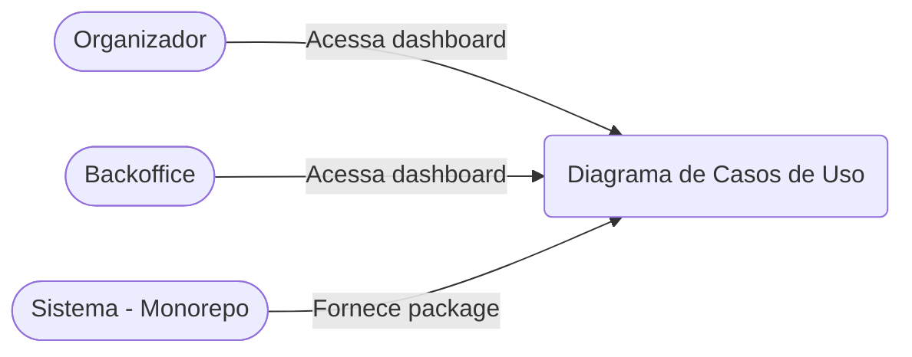
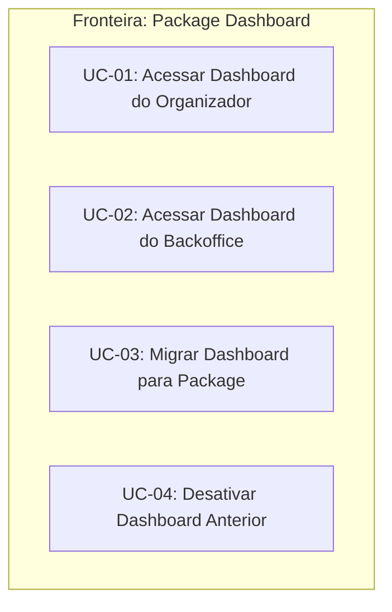
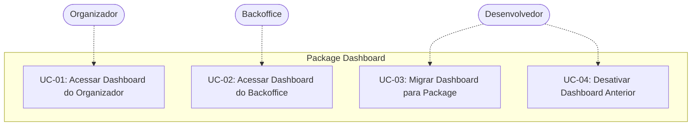

# Research - Package Dashboard

## 1. Contexto do Produto

O painel do organizador no Linka Eventos conta atualmente com um dashboard que centraliza as principais informações de acompanhamento de um evento, exibindo dados de inscrições, vendas, check-ins e receita em tempo real. Esse dashboard é acessado diretamente pelo menu lateral do painel do organizador.

O dashboard atual foi construída nativamente em React com React Query após a descontinuação do PowerBI. A proposta é criar um package compartilhado (`package-dashboard`) no monorepo para que este componente seja reutilizado tanto pelo Organizador quanto pelo Backoffice.

---

## 2. Problema do Negócio

O componente de dashboard está implementado de forma isolada dentro do projeto do Organizador, sem estar organizado como um package compartilhável dentro do monorepo. Isso limita a capacidade do time de desenvolvimento de reutilizar o componente no Backoffice, que também precisa substituir o PowerBI.

Consequências:
- Esforço desproporcional para manter código duplicado
- Risco de inconsistências entre Organizador e Backoffice
- Ciclo de desenvolvimento mais lento
- Acoplamento desnecessário entre projetos

---

## 3. Objetivo da Feature

Criar o `package-dashboard` dentro do monorepo (Turborepo) com os componentes e telas do dashboard nativo em React, permitindo que seja instanciado e utilizado por ambos os projetos:
- **Organizador** (já possui o dashboard nativo)
- **Backoffice** (substituir PowerBI pelo novo package)

Benefícios esperados:
- Padronização da arquitetura da plataforma
- Maior facilidade de manutenção e evolução
- Redução do risco de regressões
- Interface consistente nos dois projetos

---

## 4. Cenário de Uso

O Organizador acessa o painel do Linka Eventos e clica na opção "Dashboard" no menu lateral. O sistema exibe uma tela com cards e gráficos mostrando os dados do evento atualmente selecionado: total de inscrições, vendas realizadas, check-ins feitos e receita gerada. Os dados são atualizados automaticamente via polling (React Query).

O Backoffice, ao acessar seu painel administrativo, também terá acesso ao Dashboard através do menu lateral, utilizando o mesmo `package-dashboard` instanciado com dados do contexto do Backoffice.

---

## 5. Atores

| Ator | Descrição | Estereótipo |
|------|-----------|-------------|
| Organizador | Usuário principal que acessa o dashboard do Organizador para acompanhar dados de seus eventos | Humano |
| Backoffice | Sistema administrativo que utiliza o mesmo package-dashboard para exibir dados | Sistema |
| Monorepo (Turborepo) | Infraestrutura que hospeda e compartilha o package-dashboard entre os projetos | Sistema |

---

## 6. Casos de Uso

| UC | Nome | Tipo | Ator Principal |
|----|------|------|----------------|
| UC-01 | Acessar Dashboard do Organizador | Primário | Organizador |
| UC-02 | Acessar Dashboard do Backoffice | Primário | Backoffice |
| UC-03 | Migrar Dashboard para Package | Secundário | Desenvolvedor |
| UC-04 | Desativar Dashboard Anterior | Secundário | Desenvolvedor |

---

## 7. Documentação dos Casos de Uso

### Referências aos Casos de Uso

| UC | Arquivo | Descrição |
|----|---------|-----------|
| UC-01 | [uc-01-acessar-dashboard-organizador](./uc-01-acessar-dashboard-organizador/uc-01-acessar-dashboard-organizador.md) | Acesso ao dashboard via menu lateral do Organizador |
| UC-02 | [uc-02-acessar-dashboard-backoffice](./uc-02-acessar-dashboard-backoffice/uc-02-acessar-dashboard-backoffice.md) | Acesso ao dashboard via menu lateral do Backoffice |
| UC-03 | [uc-03-migrar-dashboard-package](./uc-03-migrar-dashboard-package/uc-03-migrar-dashboard-package.md) | Migração do dashboard para package compartilhado |
| UC-04 | [uc-04-desativar-dashboard-anterior](./uc-04-desativar-dashboard-anterior/uc-04-desativar-dashboard-anterior.md) | Desativação do componente anterior |

---

## 8. Associações

### 8.1. Generalização/Especialização

Não se aplica a este contexto.

### 8.2. Inclusão

Não se aplica a este contexto.

### 8.3. Extensão

Não se aplica a este contexto.

### 8.4. Estereótipos

| Estereótipo | Uso |
|-------------|-----|
| `<<system>>` | Indica que o ator não é humano (Monorepo, Backoffice) |
| `<<include>>` | Comportamento comum incluído em outros UC (futuro, se aplicável) |
| `<<extend>>` | Comportamento opcional que estende outro UC (futuro, se aplicável) |

---

## 9. Fronteira de Sistema

**Fora da fronteira:** APIs de dados (Inscrições, Vendas, Check-ins, Receita), Bancos de dados, Autenticação.

---

## 10. Jobs To Be Done

- **Job principal:**
  - Como Organizador, quero visualizar os dados do meu evento (inscrições, vendas, check-ins, receita) em tempo real para acompanhar o desempenho do evento.

- **Jobs secundários:**
  - Como Desenvolvedor, quero manter o dashboard em um package compartilhado para evitar duplicação de código entre Organizador e Backoffice.
  - Como Backoffice, quero exibir dados de dashboard para tomada de decisão administrativa.
  - Como Time de Desenvolvimento, quero desativar o componente anterior após validação para completar a migração.

---

## 11. Métricas de Sucesso

- **Métricas de produto:**
  - Dashboard acessível e funcional tanto no Organizador quanto no Backoffice
  - Tempo de carregamento do dashboard < 3 segundos
  - Dados exibidos corretamente: inscrições, vendas, check-ins, receita

- **Métricas técnicas:**
  - Package publicado e importado corretamente nos dois projetos
  - Zero regressões nas regras de negócio existentes
  - Cobertura de testes nos componentes do package
  - Build bem-sucedido no monorepo (Turborepo)

---

## 12. Questões em Aberto

- A definição de "tempo real" foi esclarecida como **polling via React Query** (intervalo a definir)
- Os dados específicos de cada projeto (Organizador vs Backoffice) serão instanciados via props/context
- A migração será manual pelo time de desenvolvimento após validação

---

## 13. Critérios de Aceite

### UC-01: Acessar Dashboard do Organizador
- [ ] Menu lateral exibe opção "Dashboard"
- [ ] Click na opção carrega o dashboard
- [ ] Exibe 4 cards: Inscrições, Vendas, Check-ins, Receita
- [ ] Dados correspondem ao evento selecionado
- [ ] Atualização automática via polling

### UC-02: Acessar Dashboard do Backoffice
- [ ] Menu lateral exibe opção "Dashboard"
- [ ] Click na opção carrega o dashboard
- [ ] Utiliza o mesmo `package-dashboard` do Organizador
- [ ] Exibe dados específicos do contexto Backoffice

### UC-03: Migrar Dashboard para Package
- [ ] Package criado na estrutura do monorepo
- [ ] Componentes exportados corretamente
- [ ] Importação funcional no Organizador
- [ ] Importação funcional no Backoffice

### UC-04: Desativar Dashboard Anterior
- [ ] Componente anterior removido do Organizador
- [ ] Componente anterior removido do Backoffice
- [ ] Ponto de acesso no menu lateral utiliza novo package
- [ ] Todas as informações anteriormente exibidas disponíveis no novo componente

---

## 14. Restrições de Negócio

1. **Migração atômica:** A substituição deve ocorrer sem período de indisponibilidade para os organizadores
2. **Não-regressão:** Regras de negócio de cálculo e exibição dos dados não podem ser alteradas
3. **Continuidade:** O novo dashboard deve ocupar exatamente o mesmo ponto de acesso do anterior
