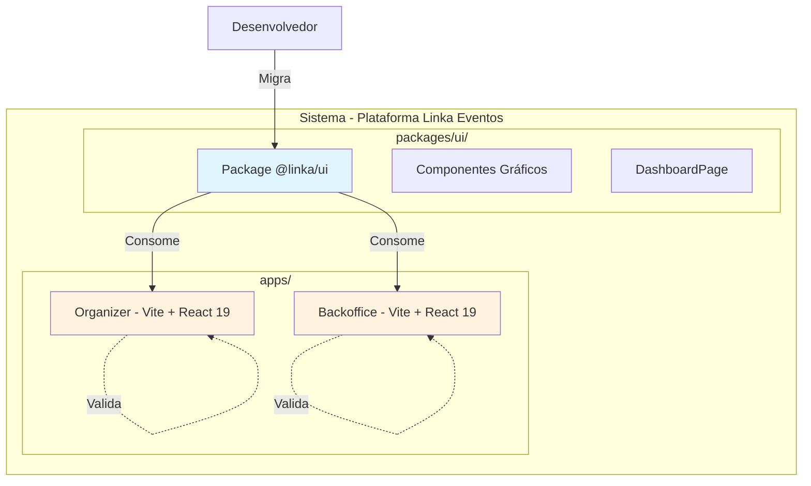

# Research - packages

- **Autor:** matheusjesus
- **Data e hora da geração:** 01/04/2026 10:55
- **Status:** developing
- **Ultima modificação:** 01/04/2026 - matheusjesus

---

## 1. Contexto do Produto

O painel do organizador no Linka Eventos possui um dashboard que centraliza informações de acompanhamento de eventos, exibindo dados de inscrições, vendas, check-ins, acessos e receita em tempo real. Atualmente, o dashboard está implementado de forma isolada, sem estar organizado como um package compartilhável no monorepo.

---

## 2. Problema do Negócio

O componente de dashboard está implementado de forma isolada, sem estar organizado como um package compartilhável dentro do monorepo. Isso limita a capacidade do time de desenvolvimento de reutilizar, manter e evoluir esse componente de maneira eficiente, gerando acoplamento desnecessário e dificultando futuras expansões.

---

## 3. Objetivo da Feature

Migrar o dashboard para um package dentro do monorepo (`@linka/ui`) e integrá-lo ao painel do organizador e backoffice, substituindo definitivamente o componente anterior. A migração será acompanhada de mudanças visuais no dashboard, entregando simultaneamente uma melhoria arquitetural e uma experiência atualizada.

---

## 4. Cenário de Uso

O desenvolvedor executa o processo de migração criando o package `@linka/ui`, migrando os componentes gráficos e a página de dashboard, integrando nos apps Organizer e Backoffice, e validando que todas as funcionalidades permanecem operacionais após a migração. O organizador continua acessando o dashboard pelo menu lateral sem perceber mudanças.

---

## 5. Atores

| ID | Ator | Estereótipo | Descrição |
|----|------|-------------|-----------|
| A01 | Desenvolvedor | `<<system>>` | Time de desenvolvimento que executa a migração |
| A02 | Organizador | - | Usuário final do dashboard, valida a não-regressão |

---

## 6. Casos de Uso

| UC | Nome | Tipo | Ator Principal |
|----|------|------|-----------------|
| UC-01 | Criar Package @linka/ui | Primário | Desenvolvedor |
| UC-02 | Migrar Componentes Gráficos para o Package | Primário | Desenvolvedor |
| UC-03 | Migrar Página de Dashboard para o Package | Primário | Desenvolvedor |
| UC-04 | Integrar Package no Organizer | Primário | Desenvolvedor |
| UC-05 | Integrar Package no Backoffice | Secundário | Desenvolvedor |
| UC-06 | Desativar Dashboard Anterior no Organizer | Secundário | Desenvolvedor |
| UC-07 | Validar Não-Regressão de Funcionalidades | Secundário | Desenvolvedor |

---

## 7. Documentação dos Casos de Uso

| UC | Nome | Arquivo |
|----|------|---------|
| UC-01 | Criar Package @linka/ui | [uc-01-criar-package-ui/uc-01-criar-package-ui.md](./uc-01-criar-package-ui/uc-01-criar-package-ui.md) |
| UC-02 | Migrar Componentes Gráficos para o Package | [uc-02-migrar-componentes-graficos/uc-02-migrar-componentes-graficos.md](./uc-02-migrar-componentes-graficos/uc-02-migrar-componentes-graficos.md) |
| UC-03 | Migrar Página de Dashboard para o Package | [uc-03-migrar-pagina-dashboard/uc-03-migrar-pagina-dashboard.md](./uc-03-migrar-pagina-dashboard/uc-03-migrar-pagina-dashboard.md) |
| UC-04 | Integrar Package no Organizer | [uc-04-integrar-organizer/uc-04-integrar-organizer.md](./uc-04-integrar-organizer/uc-04-integrar-organizer.md) |
| UC-05 | Integrar Package no Backoffice | [uc-05-integrar-backoffice/uc-05-integrar-backoffice.md](./uc-05-integrar-backoffice/uc-05-integrar-backoffice.md) |
| UC-06 | Desativar Dashboard Anterior no Organizer | [uc-06-desativar-dashboard-anterior/uc-06-desativar-dashboard-anterior.md](./uc-06-desativar-dashboard-anterior/uc-06-desativar-dashboard-anterior.md) |
| UC-07 | Validar Não-Regressão de Funcionalidades | [uc-07-validar-nao-regressao/uc-07-validar-nao-regressao.md](./uc-07-validar-nao-regressao/uc-07-validar-nao-regressao.md) |

---

## 8. Associações

### 8.1. Generalização/Especialização

Não se aplica. Não há casos de uso especializados nesta feature.

### 8.2. Inclusão

```
UC-04 (Integrar no Organizer) --include--> UC-03 (Migrar Página)
UC-05 (Integrar no Backoffice) --include--> UC-03 (Migrar Página)
UC-06 (Desativar Dashboard) --include--> UC-04 (Integrar no Organizer)
UC-07 (Validar Não-Regressão) --include--> UC-06 (Desativar Dashboard)
```

### 8.3. Extensão

Não se aplica.

### 8.4. Pontos de Extensão

Não se aplica.

### 8.5. Multiplicidade

- **Desenvolvedor → UC-01 a UC-07:** 1:N (pode executar todos os casos de uso)
- **Organizador → UC-07:** N:1 (múltiplos organizadores validam)

---

## 9. Fronteira de Sistema



---

## 10. Jobs To Be Done

### Job Principal

Criar um package compartilhado `@linka/ui` no monorepo para centralizar componentes UI, gráficos e páginas reutilizáveis, permitindo que o dashboard seja utilizado tanto no Organizer quanto no Backoffice sem duplicação de código.

### Jobs Secundários

1. Migrar componentes gráficos do dashboard para o package
2. Migrar página de Dashboard para o package
3. Integrar o package no app Organizer
4. Integrar o package no app Backoffice (substituindo Power BI)
5. Desativar o dashboard local anterior
6. Validar não-regressão de funcionalidades

---

## 11. Métricas de Sucesso

### Métrica de Produto

- **Reutilização:** Dashboard utilizado em 2 apps (Organizer e Backoffice)
- **Consistência:** Interface idêntica entre Organizer e Backoffice
- **Eliminação de dependência:** Power BI Embedded removido do Backoffice

### Métrica Técnica

- **Manutenibilidade:** Componentes centralizados em um único package
- **Build:** Tempo de build otimizado pelo Turborepo
- **Cobertura:** Todos os casos de uso com critérios de aceite definidos

---

## 12. Questões em Aberto

Nenhuma questão em aberto. O PRD está completo e detalhado com todas as especificações técnicas necessárias.

---

## 13. Critérios de Aceite da Feature

| # | Critério | Status |
|---|----------|--------|
| 1 | Package `@linka/ui` criado no monorepo | ✅ |
| 2 | Componentes gráficos migrados para o package | ✅ |
| 3 | DashboardPage disponível para importação | ✅ |
| 4 | Organizer utilizando o package | ✅ |
| 5 | Backoffice utilizando o package | ✅ |
| 6 | Power BI removido do Backoffice | ✅ |
| 7 | Dashboard anterior desativado | ✅ |
| 8 | Não-regressão validada | ✅ |
| 9 | Build executando com sucesso | ✅ |

---

## 14. Referências Técnicas

### Stack

| Tecnologia | Versão | Uso |
|------------|--------|-----|
| Turborepo | - | Monorepo |
| pnpm | - | Package Manager |
| React | 19 | UI Framework |
| Recharts | 3.7.0 | Gráficos |
| @tanstack/react-table | 8.x | Tabelas |
| @radix-ui/* | - | UI Primitives |
| date-fns | 2.x | Datas |
| lucide-react | - | Ícones |

### Estrutura do Package

```
packages/ui/
├── src/
│   ├── components/
│   │   ├── charts/
│   │   ├── forms/
│   │   ├── tables/
│   │   ├── dialogs/
│   │   └── common/
│   └── pages/
│       └── Dashboard/
├── package.json
└── tsconfig.json
```
